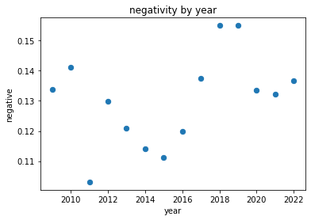
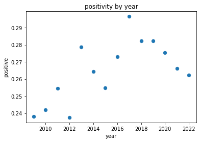
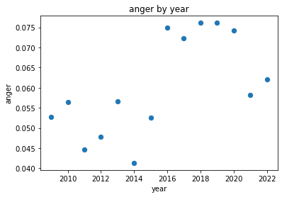

## State of the Union (2009-2022): Sentiment Analysis

By: Shirsho Dasgupta (2022)

#### Notes: 

The code reads the text of every State of the Union speech from 2009 to 2022 and performs sentiment analysis on them using the NRC Word-Emotion Association Lexicon (EmoLex). 

The NRC Emotion Lexicon is a list of English words and their associations with eight basic emotions (anger, fear, anticipation, trust, surprise, sadness, joy, and disgust) and two sentiments (negative and positive). The annotations were manually done by crowdsourcing.

The code matches the words in the speeches to that of the dictionary then adds up the factor of the emotion. 

Since EmoLex is, at the end of the day, crowdsourced and finite, there might be some words which are outside its scope or some nuances which are not accounted for (the code performs word-to-word comparison). The analysis is always at best an approximation. 

#### Sources:

State of the Union Archived Speeches at University of California, Santa Barbara: https://www.presidency.ucsb.edu/documents/presidential-documents-archive-guidebook/annual-messages-congress-the-state-the-union

NRC Emotion Lexicon: http://saifmohammad.com/WebPages/NRC-Emotion-Lexicon.htm

### Importing libraries


```python
import pandas as pd
%matplotlib inline
```

### Creating dataframe of speeches

#### Importing SOTU speeches


```python
import glob

filenames = glob.glob("sotu/*")
```


```python
speeches = [open(filename).read() for filename in filenames]
len(speeches)
```


    14


#### Storing SOTU speeches in one dataframe


```python
### stores entire text of speech under one column and the associated filename under another
speeches_df = pd.DataFrame({"text": speeches, "filename": filenames})
speeches_df.head(3)
```


<div>
<style scoped>
    .dataframe tbody tr th:only-of-type {
        vertical-align: middle;
    }

    .dataframe tbody tr th {
        vertical-align: top;
    }

    .dataframe thead th {
        text-align: right;
    }
</style>
<table border="1" class="dataframe">
  <thead>
    <tr style="text-align: right;">
      <th></th>
      <th>text</th>
      <th>filename</th>
    </tr>
  </thead>
  <tbody>
    <tr>
      <th>0</th>
      <td>Madam Speaker, Madam Vice President—no Preside...</td>
      <td>sotu/04-28-2021.txt</td>
    </tr>
    <tr>
      <th>1</th>
      <td>Madam Speaker, Vice President Biden, Members o...</td>
      <td>sotu/01-27-2010.txt</td>
    </tr>
    <tr>
      <th>2</th>
      <td>Mr. Speaker, Mr. Vice President, Members of Co...</td>
      <td>sotu/01-12-2016.txt</td>
    </tr>
  </tbody>
</table>
</div>


```python
### creates two new columns to store year and name of president
speeches_df["year"] = " "
speeches_df["pres"] = " "

### loop runs through dataframe
for i in range(0, len(speeches_df)):
    
    ### extracts (from filename) and stores year of speech
    speeches_df["year"][i] = int(speeches_df["filename"][i][-8:-4])
    x = speeches_df["year"][i]
    
    ### condition checks what year the speech was delivered and stores the name of the president accordingly
    if (x >= 2009) & (x <= 2016):
        speeches_df["pres"][i] = "obama"
    elif (x >= 2017) & (x <= 2020):
        speeches_df["pres"][i] = "trump"
    elif (x > 2020):
        speeches_df["pres"][i] = "biden"
```


```python
### displays final master dataframe
speeches_df
```


<div>
<style scoped>
    .dataframe tbody tr th:only-of-type {
        vertical-align: middle;
    }

    .dataframe tbody tr th {
        vertical-align: top;
    }

    .dataframe thead th {
        text-align: right;
    }
</style>
<table border="1" class="dataframe">
  <thead>
    <tr style="text-align: right;">
      <th></th>
      <th>text</th>
      <th>filename</th>
      <th>year</th>
      <th>pres</th>
    </tr>
  </thead>
  <tbody>
    <tr>
      <th>0</th>
      <td>Madam Speaker, Madam Vice President—no Preside...</td>
      <td>sotu/04-28-2021.txt</td>
      <td>2021</td>
      <td>biden</td>
    </tr>
    <tr>
      <th>1</th>
      <td>Madam Speaker, Vice President Biden, Members o...</td>
      <td>sotu/01-27-2010.txt</td>
      <td>2010</td>
      <td>obama</td>
    </tr>
    <tr>
      <th>2</th>
      <td>Mr. Speaker, Mr. Vice President, Members of Co...</td>
      <td>sotu/01-12-2016.txt</td>
      <td>2016</td>
      <td>obama</td>
    </tr>
    <tr>
      <th>3</th>
      <td>Madam Speaker, Mr. Vice President, Members of ...</td>
      <td>sotu/02-24-2009.txt</td>
      <td>2009</td>
      <td>obama</td>
    </tr>
    <tr>
      <th>4</th>
      <td>Mr. Speaker, Mr. Vice President, Members of Co...</td>
      <td>sotu/01-20-2015.txt</td>
      <td>2015</td>
      <td>obama</td>
    </tr>
    <tr>
      <th>5</th>
      <td>Mr. Speaker, Mr. Vice President, Members of Co...</td>
      <td>sotu/02-12-2013.txt</td>
      <td>2013</td>
      <td>obama</td>
    </tr>
    <tr>
      <th>6</th>
      <td>Thank you very much. Mr. Speaker, Mr. Vice Pre...</td>
      <td>sotu/02-28-2017.txt</td>
      <td>2017</td>
      <td>trump</td>
    </tr>
    <tr>
      <th>7</th>
      <td>Mr. Speaker, Mr. Vice President, Members of Co...</td>
      <td>sotu/02-05-2019.txt</td>
      <td>2019</td>
      <td>trump</td>
    </tr>
    <tr>
      <th>8</th>
      <td>Mr. Speaker, Mr. Vice President, Members of Co...</td>
      <td>sotu/01-25-2011.txt</td>
      <td>2011</td>
      <td>obama</td>
    </tr>
    <tr>
      <th>9</th>
      <td>Madam Speaker, Mr. Vice President, Members of ...</td>
      <td>sotu/02-04-2020.txt</td>
      <td>2020</td>
      <td>trump</td>
    </tr>
    <tr>
      <th>10</th>
      <td>Mr. Speaker, Mr. Vice President, Members of Co...</td>
      <td>sotu/01-24-2012.txt</td>
      <td>2012</td>
      <td>obama</td>
    </tr>
    <tr>
      <th>11</th>
      <td>Madam Speaker, Madam Vice President, and our F...</td>
      <td>sotu/03-01-2022.txt</td>
      <td>2022</td>
      <td>biden</td>
    </tr>
    <tr>
      <th>12</th>
      <td>Mr. Speaker, Mr. Vice President, Members of Co...</td>
      <td>sotu/01-28-2014.txt</td>
      <td>2014</td>
      <td>obama</td>
    </tr>
    <tr>
      <th>13</th>
      <td>Mr. Speaker, Mr. Vice President, Members of Co...</td>
      <td>sotu/01-30-2018.txt</td>
      <td>2018</td>
      <td>trump</td>
    </tr>
  </tbody>
</table>
</div>


#### Creating separate dataframes for each president


```python
### filters by name of president and stores in separate dataframes
speeches_df_obama = speeches_df[speeches_df["pres"] == "obama"] 
speeches_df_trump = speeches_df[speeches_df["pres"] == "trump"] 
speeches_df_biden = speeches_df[speeches_df["pres"] == "biden"] 
```

### Sentiment analysis

#### Importing NRC Emotion Lexicon

Download compressed file from http://saifmohammad.com/WebPages/NRC-Emotion-Lexicon.htm

Move the relevant text-file to the directory


```python
filepath = "NRC-Emotion-Lexicon-Wordlevel-v0.92.txt"
emolex_df = pd.read_csv(filepath,  names = ["word", "emotion", "association"], sep = "\t", keep_default_na = False)
emolex_df = emolex_df.pivot(index = "word", columns = "emotion", values = "association").reset_index()
emolex_df.head()
```


<div>
<style scoped>
    .dataframe tbody tr th:only-of-type {
        vertical-align: middle;
    }

    .dataframe tbody tr th {
        vertical-align: top;
    }

    .dataframe thead th {
        text-align: right;
    }
</style>
<table border="1" class="dataframe">
  <thead>
    <tr style="text-align: right;">
      <th>emotion</th>
      <th>word</th>
      <th>anger</th>
      <th>anticipation</th>
      <th>disgust</th>
      <th>fear</th>
      <th>joy</th>
      <th>negative</th>
      <th>positive</th>
      <th>sadness</th>
      <th>surprise</th>
      <th>trust</th>
    </tr>
  </thead>
  <tbody>
    <tr>
      <th>0</th>
      <td>aback</td>
      <td>0</td>
      <td>0</td>
      <td>0</td>
      <td>0</td>
      <td>0</td>
      <td>0</td>
      <td>0</td>
      <td>0</td>
      <td>0</td>
      <td>0</td>
    </tr>
    <tr>
      <th>1</th>
      <td>abacus</td>
      <td>0</td>
      <td>0</td>
      <td>0</td>
      <td>0</td>
      <td>0</td>
      <td>0</td>
      <td>0</td>
      <td>0</td>
      <td>0</td>
      <td>1</td>
    </tr>
    <tr>
      <th>2</th>
      <td>abandon</td>
      <td>0</td>
      <td>0</td>
      <td>0</td>
      <td>1</td>
      <td>0</td>
      <td>1</td>
      <td>0</td>
      <td>1</td>
      <td>0</td>
      <td>0</td>
    </tr>
    <tr>
      <th>3</th>
      <td>abandoned</td>
      <td>1</td>
      <td>0</td>
      <td>0</td>
      <td>1</td>
      <td>0</td>
      <td>1</td>
      <td>0</td>
      <td>1</td>
      <td>0</td>
      <td>0</td>
    </tr>
    <tr>
      <th>4</th>
      <td>abandonment</td>
      <td>1</td>
      <td>0</td>
      <td>0</td>
      <td>1</td>
      <td>0</td>
      <td>1</td>
      <td>0</td>
      <td>1</td>
      <td>1</td>
      <td>0</td>
    </tr>
  </tbody>
</table>
</div>


#### Calculating share of words using TfidfVectorizer


```python
from sklearn.feature_extraction.text import TfidfVectorizer

vec = TfidfVectorizer(vocabulary = emolex_df.word, use_idf = False, norm = "l1") 
matrix = vec.fit_transform(speeches_df.text)
vocab = vec.get_feature_names()
wordcount_df = pd.DataFrame(matrix.toarray(), columns = vocab)
wordcount_df.head()
```


<div>
<style scoped>
    .dataframe tbody tr th:only-of-type {
        vertical-align: middle;
    }

    .dataframe tbody tr th {
        vertical-align: top;
    }

    .dataframe thead th {
        text-align: right;
    }
</style>
<table border="1" class="dataframe">
  <thead>
    <tr style="text-align: right;">
      <th></th>
      <th>aback</th>
      <th>abacus</th>
      <th>abandon</th>
      <th>abandoned</th>
      <th>abandonment</th>
      <th>abate</th>
      <th>abatement</th>
      <th>abba</th>
      <th>abbot</th>
      <th>abbreviate</th>
      <th>...</th>
      <th>zephyr</th>
      <th>zeppelin</th>
      <th>zest</th>
      <th>zip</th>
      <th>zodiac</th>
      <th>zone</th>
      <th>zoo</th>
      <th>zoological</th>
      <th>zoology</th>
      <th>zoom</th>
    </tr>
  </thead>
  <tbody>
    <tr>
      <th>0</th>
      <td>0.0</td>
      <td>0.0</td>
      <td>0.000000</td>
      <td>0.0</td>
      <td>0.0</td>
      <td>0.0</td>
      <td>0.0</td>
      <td>0.0</td>
      <td>0.0</td>
      <td>0.0</td>
      <td>...</td>
      <td>0.0</td>
      <td>0.0</td>
      <td>0.0</td>
      <td>0.0</td>
      <td>0.0</td>
      <td>0.00105</td>
      <td>0.0</td>
      <td>0.0</td>
      <td>0.0</td>
      <td>0.0</td>
    </tr>
    <tr>
      <th>1</th>
      <td>0.0</td>
      <td>0.0</td>
      <td>0.000000</td>
      <td>0.0</td>
      <td>0.0</td>
      <td>0.0</td>
      <td>0.0</td>
      <td>0.0</td>
      <td>0.0</td>
      <td>0.0</td>
      <td>...</td>
      <td>0.0</td>
      <td>0.0</td>
      <td>0.0</td>
      <td>0.0</td>
      <td>0.0</td>
      <td>0.00000</td>
      <td>0.0</td>
      <td>0.0</td>
      <td>0.0</td>
      <td>0.0</td>
    </tr>
    <tr>
      <th>2</th>
      <td>0.0</td>
      <td>0.0</td>
      <td>0.000000</td>
      <td>0.0</td>
      <td>0.0</td>
      <td>0.0</td>
      <td>0.0</td>
      <td>0.0</td>
      <td>0.0</td>
      <td>0.0</td>
      <td>...</td>
      <td>0.0</td>
      <td>0.0</td>
      <td>0.0</td>
      <td>0.0</td>
      <td>0.0</td>
      <td>0.00000</td>
      <td>0.0</td>
      <td>0.0</td>
      <td>0.0</td>
      <td>0.0</td>
    </tr>
    <tr>
      <th>3</th>
      <td>0.0</td>
      <td>0.0</td>
      <td>0.000000</td>
      <td>0.0</td>
      <td>0.0</td>
      <td>0.0</td>
      <td>0.0</td>
      <td>0.0</td>
      <td>0.0</td>
      <td>0.0</td>
      <td>...</td>
      <td>0.0</td>
      <td>0.0</td>
      <td>0.0</td>
      <td>0.0</td>
      <td>0.0</td>
      <td>0.00000</td>
      <td>0.0</td>
      <td>0.0</td>
      <td>0.0</td>
      <td>0.0</td>
    </tr>
    <tr>
      <th>4</th>
      <td>0.0</td>
      <td>0.0</td>
      <td>0.000604</td>
      <td>0.0</td>
      <td>0.0</td>
      <td>0.0</td>
      <td>0.0</td>
      <td>0.0</td>
      <td>0.0</td>
      <td>0.0</td>
      <td>...</td>
      <td>0.0</td>
      <td>0.0</td>
      <td>0.0</td>
      <td>0.0</td>
      <td>0.0</td>
      <td>0.00000</td>
      <td>0.0</td>
      <td>0.0</td>
      <td>0.0</td>
      <td>0.0</td>
    </tr>
  </tbody>
</table>
<p>5 rows × 14154 columns</p>
</div>


#### Applying EmoLex

The words which appear per category in the NRC Emotion Lexicon dictionary are identified and their shares are added up. The sum gives the total share of the document that relates to a particular emotion or sentiment. For instance say a document has two "angry" words each making up 0.01 of the text, then the anger-factor as it were of the text is 0.02 (= 0.01 + 0.01). 


```python
### identifies all negative words
neg_words = emolex_df[emolex_df.negative == 1]["word"]
### adds up shares of negative words
speeches_df["negative"] = wordcount_df[neg_words].sum(axis = 1)

### the above process is repeated per sentiment

pos_words = emolex_df[emolex_df.positive == 1]["word"]
speeches_df["positive"] = wordcount_df[pos_words].sum(axis = 1)

angry_words = emolex_df[emolex_df.anger == 1]["word"]
speeches_df["anger"] = wordcount_df[angry_words].sum(axis = 1)

anticip_words = emolex_df[emolex_df.anticipation == 1]["word"]
speeches_df["anticipation"] = wordcount_df[anticip_words].sum(axis = 1)

disgust_words = emolex_df[emolex_df.disgust == 1]["word"]
speeches_df["disgust"] = wordcount_df[disgust_words].sum(axis = 1)

fear_words = emolex_df[emolex_df.fear == 1]["word"]
speeches_df["fear"] = wordcount_df[fear_words].sum(axis = 1)

joy_words = emolex_df[emolex_df.joy == 1]["word"]
speeches_df["joy"] = wordcount_df[joy_words].sum(axis = 1)

sad_words = emolex_df[emolex_df.sadness == 1]["word"]
speeches_df["sadness"] = wordcount_df[sad_words].sum(axis = 1)

surprise_words = emolex_df[emolex_df.surprise == 1]["word"]
speeches_df["surprise"] = wordcount_df[surprise_words].sum(axis = 1)

trust_words = emolex_df[emolex_df.trust == 1]["word"]
speeches_df["trust"] = wordcount_df[trust_words].sum(axis = 1)
```


```python
### displays final dataframe
speeches_df.head()
```


<div>
<style scoped>
    .dataframe tbody tr th:only-of-type {
        vertical-align: middle;
    }

    .dataframe tbody tr th {
        vertical-align: top;
    }

    .dataframe thead th {
        text-align: right;
    }
</style>
<table border="1" class="dataframe">
  <thead>
    <tr style="text-align: right;">
      <th></th>
      <th>text</th>
      <th>filename</th>
      <th>year</th>
      <th>pres</th>
      <th>negative</th>
      <th>positive</th>
      <th>anger</th>
      <th>anticipation</th>
      <th>disgust</th>
      <th>fear</th>
      <th>joy</th>
      <th>sadness</th>
      <th>surprise</th>
      <th>trust</th>
    </tr>
  </thead>
  <tbody>
    <tr>
      <th>0</th>
      <td>Madam Speaker, Madam Vice President—no Preside...</td>
      <td>sotu/04-28-2021.txt</td>
      <td>2021</td>
      <td>biden</td>
      <td>0.132283</td>
      <td>0.266142</td>
      <td>0.058268</td>
      <td>0.114961</td>
      <td>0.034646</td>
      <td>0.087664</td>
      <td>0.080315</td>
      <td>0.061942</td>
      <td>0.039370</td>
      <td>0.167454</td>
    </tr>
    <tr>
      <th>1</th>
      <td>Madam Speaker, Vice President Biden, Members o...</td>
      <td>sotu/01-27-2010.txt</td>
      <td>2010</td>
      <td>obama</td>
      <td>0.141074</td>
      <td>0.241997</td>
      <td>0.056430</td>
      <td>0.102550</td>
      <td>0.038524</td>
      <td>0.083017</td>
      <td>0.083559</td>
      <td>0.066196</td>
      <td>0.039067</td>
      <td>0.167119</td>
    </tr>
    <tr>
      <th>2</th>
      <td>Mr. Speaker, Mr. Vice President, Members of Co...</td>
      <td>sotu/01-12-2016.txt</td>
      <td>2016</td>
      <td>obama</td>
      <td>0.119947</td>
      <td>0.273028</td>
      <td>0.074884</td>
      <td>0.111332</td>
      <td>0.031809</td>
      <td>0.098078</td>
      <td>0.098078</td>
      <td>0.065606</td>
      <td>0.054341</td>
      <td>0.184228</td>
    </tr>
    <tr>
      <th>3</th>
      <td>Madam Speaker, Mr. Vice President, Members of ...</td>
      <td>sotu/02-24-2009.txt</td>
      <td>2009</td>
      <td>obama</td>
      <td>0.133794</td>
      <td>0.238065</td>
      <td>0.052764</td>
      <td>0.108668</td>
      <td>0.042085</td>
      <td>0.081658</td>
      <td>0.067839</td>
      <td>0.059673</td>
      <td>0.029523</td>
      <td>0.175251</td>
    </tr>
    <tr>
      <th>4</th>
      <td>Mr. Speaker, Mr. Vice President, Members of Co...</td>
      <td>sotu/01-20-2015.txt</td>
      <td>2015</td>
      <td>obama</td>
      <td>0.111111</td>
      <td>0.254831</td>
      <td>0.052536</td>
      <td>0.115338</td>
      <td>0.035628</td>
      <td>0.073671</td>
      <td>0.076087</td>
      <td>0.048913</td>
      <td>0.048913</td>
      <td>0.162440</td>
    </tr>
  </tbody>
</table>
</div>


#### Exporting the dataset


```python
speeches_df.to_csv("sotu_analysis.csv", index = False)
```

#### Plotting the data

##### Negativity by year


```python
speeches_df.plot(title = "negativity by year", x = "year", y = "negative", kind = "scatter", s = 40)
```


    <matplotlib.axes._subplots.AxesSubplot at 0x7fb6decdf1f0>





##### Positivity by year


```python
speeches_df.plot(title = "positivity by year", x = "year", y = "positive", kind = "scatter", s = 40)
```


    <matplotlib.axes._subplots.AxesSubplot at 0x7fb6dde0e6a0>





##### Anger by year


```python
speeches_df.plot(title = "anger by year", x = "year", y = "anger", kind = "scatter", s = 40)
```


    <matplotlib.axes._subplots.AxesSubplot at 0x7fb6de157fa0>





#### Note: 
The same plots can be drawn with other variables like positivity vs. negativity, anger vs. fear and so on. 
